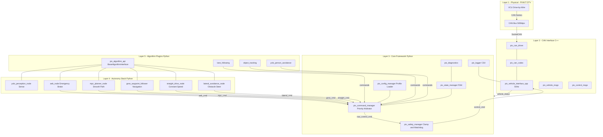
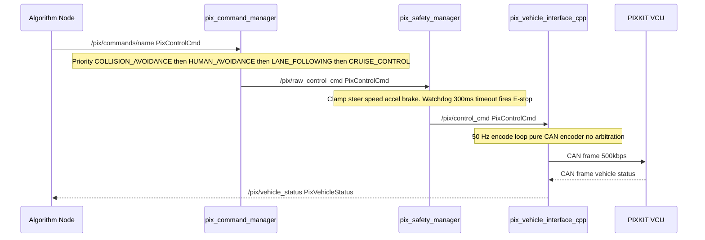

<div align="center">

# PIX Control Framework

[](https://docs.ros.org/en/humble/)
[](https://www.python.org/)
[](https://isocpp.org/)
[](LICENSE)
[](https://github.com/manish-gupta-in/pix_control_framework/releases/tag/v19.0)
[](https://www.pixmoving.com/)

**A modular, safety-first ROS 2 framework for autonomous control of the PIXKIT Drive-by-Wire shuttle.**  
Built on a layered Sense → Plan → Act architecture with a C++ CAN codec, priority-based command arbitration, and a hot-swappable algorithm API.

</div>

---

## Table of Contents

1. [Architecture Overview](#architecture-overview)
2. [Data Flow](#data-flow)
3. [Package Reference](#package-reference)
4. [Repository Layout](#repository-layout)
5. [Prerequisites](#prerequisites)
6. [Build Instructions](#build-instructions)
7. [Hardware Setup](#hardware-setup)
8. [Launch Reference](#launch-reference)
9. [Running Tests](#running-tests)
10. [Writing a New Algorithm](#writing-a-new-algorithm)
11. [Version History](#version-history)

---

## Architecture Overview

The framework is organised into five independent layers. Each layer communicates exclusively through well-defined ROS 2 topics — no layer reaches across another's boundary.



---

## Data Flow

The complete command pipeline from algorithm to wheel:



---

## Package Reference

### C++ Packages

| Package | Role | Key Files |
|---|---|---|
| `pix_can_codec` | Zero-allocation byte-level CAN encoder/decoder | `can_codec.hpp`, `encoder.cpp`, `decoder.cpp` |
| `pix_can_driver` | Multi-threaded SocketCAN to ROS 2 bridge | `pix_can_driver.cpp` |
| `pix_vehicle_interface_cpp` | 50 Hz CAN command loop — pure encoder, no arbitration | `pix_vehicle_interface.cpp` |
| `pix_vehicle_msgs` | `PixControlCmd`, `PixVehicleStatus`, `PixSystemState` messages | `msg/` |
| `pix_control_msgs` | Vehicle report messages (gear, steering, velocity, mode) | `msg/`, `srv/` |

### Python Packages

| Package | Role | Key Files |
|---|---|---|
| `pix_command_manager` | Priority MUX arbitrator — selects highest-priority fresh command | `command_arbitrator.py` |
| `pix_safety_manager` | Hard-clamp, rate-limit, 300 ms watchdog, E-stop | `safety_manager_node.py`, `safety_clamp_logic.py` |
| `pix_state_manager` | STANDBY / AUTO / FAULT finite state machine | `system_state_manager_node.py` |
| `pix_config_manager` | YAML profile loader (hardware / simulation / tuning) | `config_manager_node.py` |
| `pix_diagnostics` | `/diagnostics` topic aggregator | `diagnostics_node.py` |
| `pix_logger` | CSV telemetry logger | `logger_node.py` |
| `pix_algorithm_api` | `BaseAlgorithmInterface` base class for all algorithm nodes | `base_algorithm_interface.py` |
| `pix_autonomy` | Full autonomy stack: AEB, YOLO, GNSS, MPC, Lateral, Straight | `aeb_node.py`, `yolo_perception_node.py`, `gnss_waypoint_follower.py` |
| `pix_simulator` | Kinematics simulator for offline testing | `vehicle_simulator.py` |
| `pix_vehicle_interface` | Python CAN interface utilities | `pix_vehicle_interface/` |

### Algorithm Plugins

| Package | Role |
|---|---|
| `lane_following` | Constant-heading lane-keep algorithm |
| `object_tracking` | Object state estimator plugin |
| `yolo_person_avoidance` | Full YOLO-based person detection and lateral avoidance |

---

## Repository Layout

```
pix_control_framework/
├── launch/
│   ├── hw_framework.launch.py        # Full hardware stack launch
│   ├── sim_framework.launch.py       # Simulation stack launch
│   └── algorithms/
│       ├── lane_following.launch.py
│       └── yolo_avoidance.launch.py
├── scripts/
│   ├── actuator_test.py              # Individual actuator verification
│   └── pix_framework_watcher_node.py
├── src/
│   ├── pix_can_codec/                # C++: CAN byte codec
│   ├── pix_can_driver/               # C++: SocketCAN driver
│   ├── pix_vehicle_interface_cpp/    # C++: 50 Hz CAN loop
│   ├── pix_vehicle_msgs/             # ROS 2 messages (PixControlCmd etc.)
│   ├── pix_control_msgs/             # ROS 2 vehicle report messages
│   ├── pix_command_manager/          # Python: Priority arbitrator
│   ├── pix_safety_manager/           # Python: Safety clamping
│   ├── pix_algorithm_api/            # Python: Algorithm base class
│   ├── pix_autonomy/                 # Python: Full autonomy stack (v19)
│   │   ├── pix_autonomy/
│   │   │   ├── aeb_node.py
│   │   │   ├── yolo_perception_node.py
│   │   │   ├── gnss_waypoint_follower.py
│   │   │   ├── mpc_planner_node.py
│   │   │   ├── lateral_avoidance_node.py
│   │   │   └── straight_drive_node.py
│   │   ├── config/autonomy_params.yaml
│   │   └── launch/autonomy_test.launch.py
│   ├── pix_state_manager/
│   ├── pix_config_manager/
│   ├── pix_diagnostics/
│   ├── pix_logger/
│   ├── pix_simulator/
│   ├── pix_vehicle_interface/
│   └── algorithms/
│       ├── lane_following/
│       ├── object_tracking/
│       └── yolo_person_avoidance/
├── README.md
├── PIX_AEB_STRAIGHT_TEST_MANUAL.md
├── pix_autonomy_architecture.md
└── yolov8n.pt
```

---

## Prerequisites

| Dependency | Version | Notes |
|---|---|---|
| ROS 2 | Humble | Ubuntu 22.04 LTS |
| Python | 3.10+ | `pip install ultralytics opencv-python` for YOLO |
| GCC / Clang | C++17 | For C++ packages |
| colcon | latest | `pip install colcon-common-extensions` |
| CAN utilities | any | `sudo apt install can-utils` |

---

## Build Instructions

```bash
# Clone
git clone git@github.com:manish-gupta-in/pix_control_framework.git
cd pix_control_framework

# Source ROS 2
source /opt/ros/humble/setup.bash

# Build (first time — builds all C++ and Python packages)
colcon build --symlink-install

# Source workspace
source install/setup.bash
```

> **Note:** `launch/` and `scripts/` directories are plain Python/YAML files — no build step needed. They are picked up directly at runtime.

---

## Hardware Setup

```bash
# Bring up CAN interface (run once per boot)
sudo ip link set can4 up type can bitrate 500000
sudo ip link set can4 txqueuelen 1000

# Verify VCU is online
candump can4 -n 5
```

---

## Launch Reference

| Launch File | What It Starts | When To Use |
|---|---|---|
| `launch/hw_framework.launch.py` | CAN driver, vehicle interface, safety manager, arbitrator, state manager | Every hardware session |
| `src/pix_autonomy/launch/autonomy_test.launch.py` | YOLO, AEB, Straight Drive, GNSS — full autonomy test | AEB / straight-line field tests |
| `launch/sim_framework.launch.py` | Simulator + full pipeline (no real CAN) | Offline development |
| `launch/algorithms/lane_following.launch.py` | Lane-following algorithm only | Lane-following testing |
| `launch/algorithms/yolo_avoidance.launch.py` | YOLO + avoidance stack | YOLO avoidance testing |

**Quick Start (2 terminals):**

```bash
# Terminal 1 — Core hardware pipeline
source /opt/ros/humble/setup.bash && source install/setup.bash
ros2 launch launch/hw_framework.launch.py

# Terminal 2 — Autonomy stack
source /opt/ros/humble/setup.bash && source install/setup.bash
ros2 launch pix_autonomy autonomy_test.launch.py
```

> ⚠ VCU physical switch must be in **AUTO** and e-stop must be **disengaged** before launching.

---

## Running Tests

```bash
# Run all Python unit tests
colcon test --packages-select \
  pix_safety_manager pix_command_manager pix_autonomy \
  pix_state_manager pix_diagnostics pix_logger pix_simulator

# View results
colcon test-result --verbose

# Run a specific package's tests
colcon test-result --test-result-base build/pix_safety_manager --verbose
```

---

## Writing a New Algorithm

Inherit `BaseAlgorithmInterface` — you get vehicle status feedback and a single publish method:

```python
from pix_algorithm_api.base_algorithm_interface import BaseAlgorithmInterface

class MyAlgorithmNode(BaseAlgorithmInterface):
    def __init__(self):
        # node_name, command_topic (must match arbitrator_params.yaml)
        super().__init__('my_algorithm', '/pix/commands/cruise_control')
        self.timer = self.create_timer(0.02, self.control_loop)

    def control_loop(self):
        status = self.get_vehicle_status()  # latest PixVehicleStatus
        self.publish_control_cmd(
            drive_en=True,  speed_target=2.0, accel_target=1.0,
            steer_en=True,  steer_target=0.0, steer_speed=150.0,
            gear_en=True,   gear_target=4,    # 4 = DRIVE
            park_en=True,   park_target=0,    # 0 = RELEASE
        )
```

Register the topic in `src/pix_command_manager/config/arbitrator_params.yaml`, then `colcon build --symlink-install`.

For full documentation see [`pix_autonomy_architecture.md`](pix_autonomy_architecture.md).

---

## Field Units Reference

| Field | Unit | Safety Clamp |
|---|---|---|
| `steer_target` | degrees (wheel angle) | ±500° |
| `steer_speed` | deg/s | 250 deg/s |
| `speed_target` | m/s | 5.0 m/s |
| `accel_target` | m/s² | 3.0 m/s² |
| `brake_target` | % | 100% |
| `gear_target` | int | 1=Park 2=Reverse 3=Neutral 4=Drive |
| `park_target` | int | 0=Release 1=Engage |

---

## Version History

| Version | Highlights |
|---|---|
| **v19.0** | `aeb_node` enhanced: `min_trigger_speed` and `min_distance` params; `straight_drive_node` WAKE state machine for safe VCU startup; `base_algorithm_interface` expanded API; `control_arbitrator_node.py` removed — arbitration consolidated into `pix_command_manager`; `command_arbitrator`, `lane_following`, `yolo_avoidance` updated |
| v18.0 | `pix_autonomy/setup.py` — added missing `control_arbitrator_node` console entry point; `test_imports.py` coverage extended |
| v17.0 | `straight_drive_node` — park brake release command added on drive start |
| v16.0 | `pix_autonomy` package introduced: AEB, YOLO Perception, GNSS Waypoint Follower, MPC Planner, Lateral Avoidance, Straight Drive. Full Sense→Plan→Act stack |
| v15.0 | Unified command pipeline — single `/pix/raw_control_cmd` topic, dual-message-type arbitrator, watchdog, stale-doc cleanup |
| v12.0 | `pix_control_msgs` standard message types, C++ vehicle interface (pure encoder), `pix_can_driver` |
| v11.0 | Safety manager rate-limiting and E-stop, `pix_algorithm_api` base class |
| v10.0 | Diagnostics aggregator, CSV logger, config profile loader |
| v9.0 | `pix_can_codec` C++ library, `pix_vehicle_msgs` |
| v3.0 | Algorithm plugin architecture, YOLO avoidance, lane following |
| v0.1 | Initial commit — basic CAN interface, Python command bridge |
