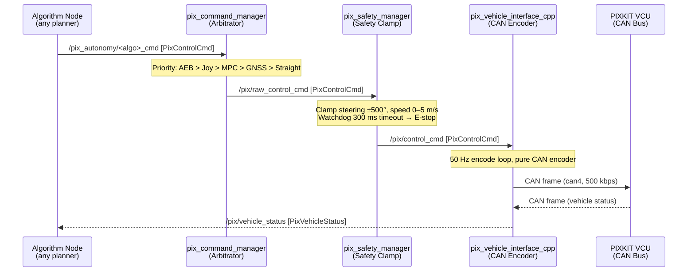

<div align="center">

# PIX Control Framework

[](https://docs.ros.org/en/humble/)
[](https://www.python.org/)
[](https://isocpp.org/)
[](LICENSE)
[](https://github.com/manish-gupta-in/pix_control_framework/releases/tag/v16.0)
[](https://www.pixmoving.com/)

**A modular, safety-first ROS 2 framework for autonomous control of the PIXKIT Drive-by-Wire shuttle.**  
Built on a layered Sense → Plan → Act architecture with a C++ CAN codec, priority-based command arbitration, and a hot-swappable algorithm API.

</div>

---

## Table of Contents

1. [Architecture Overview](#architecture-overview)
2. [Data Flow](#data-flow)
3. [Package Reference](#package-reference)
4. [Repository Layout](#repository-layout)
5. [Prerequisites](#prerequisites)
6. [Build Instructions](#build-instructions)
7. [Hardware Setup](#hardware-setup)
8. [Launch Reference](#launch-reference)
9. [Running Tests](#running-tests)
10. [Version History](#version-history)

---

## Architecture Overview

The framework is organised into four independent layers. Each layer communicates exclusively through well-defined ROS 2 topics — no layer reaches across another's boundary.

```mermaid
graph TB
    subgraph PHYS["① Physical Layer — PIXKIT DTV"]
        VCU["VCU (Drive-by-Wire)"]
        CAN["CAN Bus (can4, 500kbps)"]
    end

    subgraph CANL["② CAN Layer (C++)"]
        CODEC["pix_can_codec\n(encode / decode)"]
        DRIVER["pix_can_driver\n(SocketCAN ↔ ROS 2)"]
        IFACE["pix_vehicle_interface_cpp\n(50 Hz CAN loop)"]
        MSGS_V["pix_vehicle_msgs\n(PixControlCmd, PixVehicleStatus)"]
        MSGS_C["pix_control_msgs\n(Control, GearCommand, ControlModeReport…)"]
    end

    subgraph CORE["③ Core Framework (Python)"]
        ARB["pix_command_manager\n(Priority Arbitrator)"]
        SAFE["pix_safety_manager\n(Clamp + Watchdog)"]
        STATE["pix_state_manager\n(STANDBY / AUTO / FAULT FSM)"]
        CFG["pix_config_manager\n(Profile Loader)"]
        DIAG["pix_diagnostics\n(/diagnostics aggregator)"]
        LOG["pix_logger\n(CSV Telemetry)"]
    end

    subgraph AUTO["④ Autonomy Layer (Python)"]
        direction TB
        PERC["yolo_perception_node\n(Sense)"]
        AEB["aeb_node\n(Plan – Emergency)"]
        MPC["mpc_planner_node\n(Plan – Smooth)"]
        GNSS["gnss_waypoint_follower\n(Plan – Navigation)"]
        STR["straight_drive_node\n(Plan – Simple)"]
        LAT["lateral_avoidance_node\n(Plan – Avoidance)"]
        ARBAUTO["control_arbitrator_node\n(Act – Priority MUX)"]
    end

    subgraph ALGOS["⑤ Algorithm Layer (Python)"]
        API["pix_algorithm_api\n(BaseAlgorithmInterface)"]
        LF["lane_following"]
        OT["object_tracking"]
        YA["yolo_person_avoidance"]
    end

    VCU <-->|CAN frames| CAN
    CAN <-->|SocketCAN| DRIVER
    DRIVER --- CODEC
    CODEC --- IFACE
    IFACE -->|/pix/vehicle_status| CORE
    IFACE <--|/pix/control_cmd| SAFE

    ARB -->|/pix/raw_control_cmd| SAFE
    SAFE -->|/pix/control_cmd| IFACE
    STATE --- ARB
    CFG --- ARB
    DIAG --- STATE
    LOG --- IFACE

    AUTO -->|/pix_autonomy/*_cmd| ARB
    API --- AUTO
    ALGOS -->|/pix/commands/*| ARB
```

---

## Data Flow

The complete command pipeline from algorithm to wheel:



---

## Package Reference

### C++ Packages

| Package | Role | Key Files |
|---|---|---|
| `pix_can_codec` | Zero-allocation byte-level CAN encoder/decoder | `can_codec.hpp`, `encoder.cpp`, `decoder.cpp` |
| `pix_can_driver` | Multi-threaded SocketCAN ↔ ROS 2 bridge | `pix_can_driver.cpp` |
| `pix_vehicle_interface_cpp` | 50 Hz CAN command loop — pure encoder, no arbitration | `pix_vehicle_interface.cpp` |
| `pix_vehicle_msgs` | Custom message types (`PixControlCmd`, `PixVehicleStatus`, `PixSystemState`) | `msg/` |
| `pix_control_msgs` | Standard control messages (`Control`, `GearCommand`, `ControlModeReport`, …) | `msg/`, `srv/` |

### Python Packages

| Package | Role | Key Node(s) |
|---|---|---|
| `pix_command_manager` | Priority-based command multiplexer; accepts both legacy and standard messages | `command_arbitrator.py` |
| `pix_safety_manager` | Steering/speed clamping, rate-limiting, watchdog, E-stop logic | `safety_manager_node.py`, `safety_clamp_logic.py` |
| `pix_algorithm_api` | Base class (`BaseAlgorithmInterface`) for all algorithm nodes | `base_algorithm_interface.py` |
| `pix_autonomy` | **High-level autonomy stack** — Sense→Plan→Act nodes | `aeb_node.py`, `yolo_perception_node.py`, `gnss_waypoint_follower.py`, `mpc_planner_node.py`, `lateral_avoidance_node.py`, `straight_drive_node.py`, `control_arbitrator_node.py` |
| `pix_config_manager` | YAML profile loader (hardware / simulation / tuning) | `config_manager_node.py` |
| `pix_state_manager` | System FSM: STANDBY → AUTONOMOUS → FAULT | `system_state_manager_node.py` |
| `pix_diagnostics` | Aggregates health checks to `/diagnostics` | `diagnostics_node.py` |
| `pix_logger` | CSV telemetry logging of vehicle state | `logger_node.py` |
| `pix_simulator` | Kinematic vehicle simulator for HIL testing | `vehicle_simulator.py` |
| `lane_following` | Camera-based lane-keep algorithm (algorithm plugin) | `lane_following_node.py` |
| `object_tracking` | Multi-object tracking algorithm (algorithm plugin) | `object_tracking_node.py` |
| `yolo_person_avoidance` | YOLO-based person avoidance algorithm (algorithm plugin) | `yolo_avoidance_node.py` |

---

## Repository Layout

```
pix_control_framework/
├── launch/
│   ├── hw_framework.launch.py        # Core CAN interface (hardware)
│   ├── sim_framework.launch.py       # Simulation stack
│   ├── sim_config.rviz               # RViz config for simulation
│   └── algorithms/
│       ├── lane_following.launch.py
│       └── yolo_avoidance.launch.py
├── scripts/
│   ├── actuator_test.py              # Manual actuator test tool
│   └── pix_framework_watcher_node.py # Health watcher
├── src/
│   ├── pix_can_codec/                # C++: CAN encode/decode library
│   ├── pix_can_driver/               # C++: SocketCAN driver
│   ├── pix_vehicle_interface_cpp/    # C++: 50 Hz CAN command loop
│   ├── pix_vehicle_msgs/             # Custom ROS 2 message types
│   ├── pix_control_msgs/             # Standard control message types
│   ├── pix_command_manager/          # Python: Priority arbitrator
│   ├── pix_safety_manager/           # Python: Safety clamping
│   ├── pix_algorithm_api/            # Python: Algorithm base class
│   ├── pix_autonomy/                 # Python: Full autonomy stack (v16)
│   │   ├── pix_autonomy/
│   │   │   ├── aeb_node.py
│   │   │   ├── yolo_perception_node.py
│   │   │   ├── gnss_waypoint_follower.py
│   │   │   ├── mpc_planner_node.py
│   │   │   ├── lateral_avoidance_node.py
│   │   │   ├── straight_drive_node.py
│   │   │   └── control_arbitrator_node.py
│   │   ├── launch/autonomy_test.launch.py
│   │   └── config/autonomy_params.yaml
│   ├── pix_config_manager/           # Python: Profile loader
│   ├── pix_state_manager/            # Python: System FSM
│   ├── pix_diagnostics/              # Python: Diagnostics aggregator
│   ├── pix_logger/                   # Python: CSV telemetry
│   ├── pix_simulator/                # Python: Kinematic simulator
│   └── algorithms/
│       ├── lane_following/
│       ├── object_tracking/
│       └── yolo_person_avoidance/
├── yolov8n.pt                        # YOLO v8 Nano weights
├── update_maintainers.py
├── .gitignore
├── LICENSE
├── README.md
├── pix_autonomy_architecture.md      # Sense→Plan→Act architecture guide
└── PIX_AEB_STRAIGHT_TEST_MANUAL.md  # AEB + straight-line safety manual
```

---

## Prerequisites

| Dependency | Version | Install |
|---|---|---|
| Ubuntu | 22.04 LTS | — |
| ROS 2 | Humble Hawksbill | [ros.org](https://docs.ros.org/en/humble/Installation.html) |
| Python | ≥ 3.10 | `sudo apt install python3` |
| colcon | latest | `sudo apt install python3-colcon-common-extensions` |
| OpenCV | ≥ 4.5 | `sudo apt install python3-opencv` |
| Ultralytics YOLO | ≥ 8.0 | `pip install ultralytics` |
| cv_bridge | Humble | `sudo apt install ros-humble-cv-bridge` |
| can-utils | latest | `sudo apt install can-utils` |

---

## Build Instructions

```bash
# 1. Clone the repository
git clone git@github.com:manish-gupta-in/pix_control_framework.git
cd pix_control_framework

# 2. Source ROS 2
source /opt/ros/humble/setup.bash

# 3. Build all packages
colcon build --symlink-install

# 4. Source the workspace
source install/setup.bash
```

### Build a specific package

```bash
colcon build --packages-select pix_autonomy --symlink-install
source install/setup.bash
```

### Clean build

```bash
rm -rf build/ install/ log/
colcon build --symlink-install
```

---

## Hardware Setup

### CAN Interface

```bash
# Bring up the CAN interface (run once after boot)
sudo ip link set can4 up type can bitrate 500000
sudo ip link set can4 txqueuelen 1000

# Verify
candump can4
```

### VCU Mode

> ⚠ **Critical:** The physical VCU remote-control selector **must be in AUTO position** before issuing any gear or drive commands. In STANDBY mode the VCU ignores all `Gear_EnCtrl` signals.

```bash
# Verify VCU is in AUTO mode (ModeState = 1)
candump can4 | grep 505    # Should show: ...20 01
```

---

## Launch Reference

| Launch File | Purpose | Command |
|---|---|---|
| `hw_framework.launch.py` | Core CAN interface (hardware) — no algorithms | `ros2 launch launch/hw_framework.launch.py` |
| `sim_framework.launch.py` | Full simulation stack with RViz | `ros2 launch launch/sim_framework.launch.py` |
| `algorithms/yolo_avoidance.launch.py` | YOLO person avoidance algorithm | `ros2 launch launch/algorithms/yolo_avoidance.launch.py` |
| `algorithms/lane_following.launch.py` | Lane following algorithm | `ros2 launch launch/algorithms/lane_following.launch.py` |
| `autonomy_test.launch.py` | Full autonomy test (AEB + YOLO + Straight Drive) | `ros2 launch src/pix_autonomy/launch/autonomy_test.launch.py` |

### Typical Hardware Workflow

```bash
# Terminal 1 — Core framework
ros2 launch launch/hw_framework.launch.py

# Terminal 2 — Full autonomy test
ros2 launch src/pix_autonomy/launch/autonomy_test.launch.py
```

---

## Running Tests

```bash
# Run all tests
colcon test --event-handlers console_direct+
colcon test-result --verbose

# Run tests for a specific package
colcon test --packages-select pix_safety_manager
colcon test-result --test-result-base build/pix_safety_manager --verbose
```

### Test Coverage by Package

| Package | Test File | What It Covers |
|---|---|---|
| `pix_state_manager` | `test_state_machine.py` | FSM transitions (STANDBY↔AUTO↔FAULT) |
| `pix_safety_manager` | `test_safety_logic.py`, `test_safety_and_arbitration.py` | Clamping, rate-limits, watchdog, E-stop |
| `pix_command_manager` | `test_arbitration_logic.py` | Priority ordering, command preemption |
| `pix_simulator` | `test_kinematics.py` | Kinematic model accuracy |
| `pix_diagnostics` | `test_diagnostics_logic.py` | Health check aggregation |
| `pix_logger` | `test_logger_config.py` | Logger configuration parsing |
| `pix_can_codec` | `test_can_codec.cpp` (GTest) | CAN frame encode/decode round-trip |
| `pix_autonomy` | `test_imports.py` | Package import sanity |

---

## Version History

| Version | Date | Highlights |
|---|---|---|
| **v16.0** | 2026-09 | `pix_autonomy` package: AEB, YOLO Perception, GNSS Waypoint Follower, MPC Planner, Lateral Avoidance, Straight Drive, Control Arbitrator. Full Sense→Plan→Act stack. |
| v15.0 | 2026-08 | Unified command pipeline — single `/pix/raw_control_cmd` topic, dual-message-type arbitrator, watchdog, stale-doc cleanup |
| v12.0 | 2026-07 | `pix_control_msgs` standard message types, C++ vehicle interface (pure encoder), `pix_can_driver` |
| v11.0 | 2026-06 | Safety manager rate-limiting and E-stop, `pix_algorithm_api` base class |
| v10.0 | 2026-05 | Diagnostics aggregator, CSV logger, config profile loader |
| v9.0 | 2026-04 | `pix_can_codec` C++ library, `pix_vehicle_msgs` |
| v3.0 | 2026-02 | Algorithm plugin architecture, YOLO avoidance, lane following |
| v0.1 | 2026-01 | Initial commit — basic CAN interface, Python command bridge |

---

## License

Proprietary — PIXMOVING / Manish Gupta. All rights reserved.  
See [LICENSE](LICENSE) for details.
