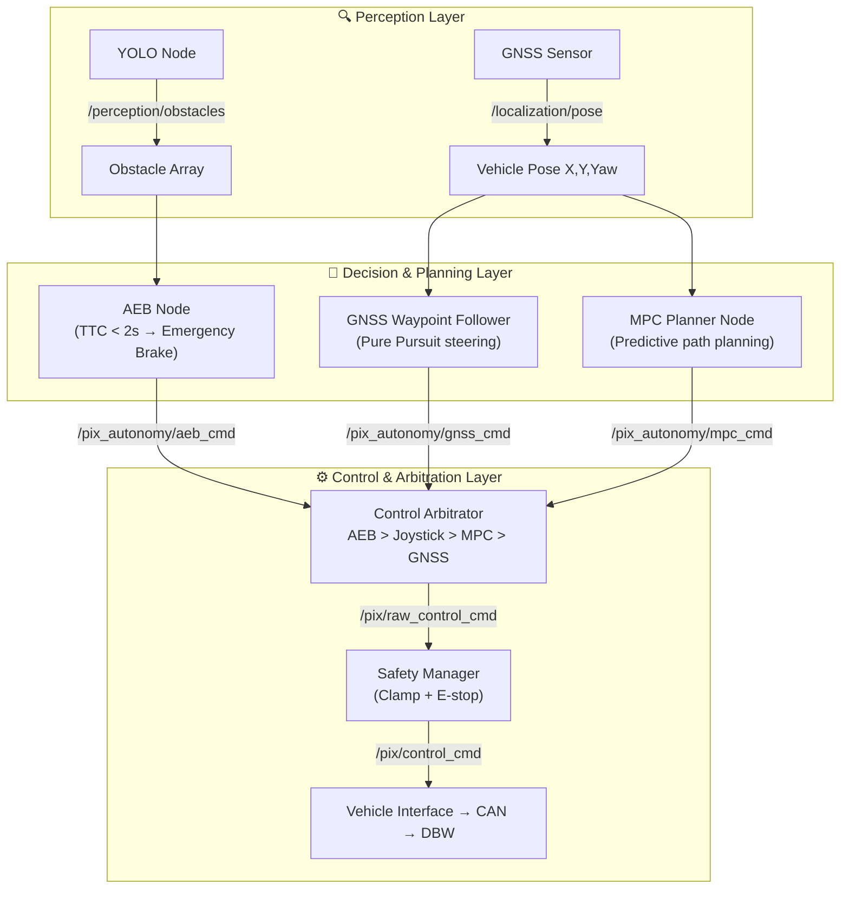

# PIX Control Framework (PCF) — v15.0

> A **modular, hardware-agnostic autonomous vehicle control framework** built on ROS 2.  
> Algorithms stay completely independent of hardware. Swap vehicles, keep your autonomy stack.

[](https://docs.ros.org)
[](LICENSE)
[](https://github.com/manish-gupta-in/pix_control_framework/releases/tag/v15.0)
[](https://python.org)
[](https://isocpp.org)

---

## Overview

The **PIX Control Framework (PCF)** implements a production-grade **Sense → Plan → Act** architecture for autonomous vehicles. It provides a clean separation of concerns so that:

- **Algorithm developers** write against a stable API — no hardware knowledge needed
- **Platform engineers** write vehicle drivers once — reusable across any algorithm
- **Safety engineers** own a dedicated layer — independent of both algorithms and hardware

Supported vehicles use any DBW (Drive-By-Wire) interface via CAN. Supported algorithms include lane following, YOLO-based person avoidance, GNSS waypoint following, MPC planning, and AEB.

---

## Architecture

### System Layers

```
┌──────────────────────────────────────────────────────────────┐
│                     SENSE (Perception)                        │
│        YOLO Node ──► /perception/obstacles                    │
│        GNSS Sensor ──► /localization/pose                     │
└─────────────────────────────┬────────────────────────────────┘
                              │
┌─────────────────────────────▼────────────────────────────────┐
│                     PLAN (Decision)                           │
│   AEB Node  ──► /pix_autonomy/aeb_cmd     (reflexes)         │
│   MPC Planner ──► /pix_autonomy/mpc_cmd   (advanced)         │
│   GNSS Follower ──► /pix_autonomy/gnss_cmd (basic)           │
└─────────────────────────────┬────────────────────────────────┘
                              │
┌─────────────────────────────▼────────────────────────────────┐
│                     ACT (Control)                             │
│                                                               │
│  Control Arbitrator  ──► /pix/raw_control_cmd                 │
│       (Priority: AEB > Joystick > MPC > GNSS)                │
│                              │                                │
│  Safety Manager ──► /pix/control_cmd                          │
│       (Velocity/steering clamp, E-stop)                       │
│                              │                                │
│  Vehicle Interface (Python / C++)                             │
│                              │                                │
│  CAN Codec → CAN Driver → Physical DBW Hardware              │
└──────────────────────────────────────────────────────────────┘
```

### Data Flow Diagram



### Why This Design?

| Principle | How PCF implements it |
|---|---|
| **Algorithm ↔ Hardware decoupling** | `pix_algorithm_api` base class — algorithms never import vehicle drivers |
| **Safety isolation** | `pix_safety_manager` is the only node that can apply emergency overrides |
| **Priority arbitration** | `pix_command_manager` enforces strict priority ordering |
| **State-machine driven** | `pix_state_manager` FSM prevents invalid transitions (Init → Auto → Manual → Fault) |
| **CAN abstraction** | `pix_can_codec` + `pix_can_driver` hide all CAN frame details |

---

## Package Reference

### Core Framework

| Package | Language | Description |
|---|---|---|
| `pix_algorithm_api` | Python | Base class all algorithms inherit from |
| `pix_command_manager` | Python | Command prioritisation & arbitration |
| `pix_state_manager` | Python | FSM: Init → Autonomous → Manual → Fault |
| `pix_safety_manager` | Python | AEB logic, velocity/steering clamp, emergency stop |
| `pix_config_manager` | Python | Runtime config profiles (hw / sim / tuning) |
| `pix_diagnostics` | Python | System health monitoring & reporting |
| `pix_logger` | Python | Structured data logging |

### Vehicle Interface

| Package | Language | Description |
|---|---|---|
| `pix_vehicle_interface` | Python | Platform-agnostic DBW interface |
| `pix_vehicle_interface_cpp` | C++ | High-performance DBW interface |
| `pix_can_codec` | C++ | CAN frame encoder/decoder library |
| `pix_can_driver` | C++ | SocketCAN driver node |

### Message Definitions

| Package | Description |
|---|---|
| `pix_control_msgs` | Standardised control messages (`Control`, `GearCommand`, `VelocityReport`, etc.) |
| `pix_vehicle_msgs` | Vehicle-specific messages (`PixControlCmd`, `PixVehicleStatus`, `PixSystemState`) |

### Autonomy Stack

| Package | Language | Description |
|---|---|---|
| `pix_autonomy` | Python | AEB, MPC planner, GNSS follower, YOLO perception, Control Arbitrator |
| `algorithms/lane_following` | Python | Lane-following algorithm node |
| `algorithms/yolo_person_avoidance` | Python | YOLO-based person avoidance node |
| `algorithms/object_tracking` | Python | Object tracking algorithm node |
| `pix_simulator` | Python | Kinematic vehicle simulator for SITL testing |

---

## Quick Start

### Prerequisites

```bash
# ROS 2 Humble or Iron
sudo apt install ros-humble-desktop python3-colcon-common-extensions
```

### Clone & Build

```bash
mkdir -p pcf_ws/src && cd pcf_ws/src
git clone https://github.com/manish-gupta-in/pix_control_framework.git
cd ..
rosdep install --from-paths src --ignore-src -r -y
colcon build --symlink-install
source install/setup.bash
```

### Run — Hardware Mode

```bash
# Bring up CAN interface first
sudo ip link set can4 up type can bitrate 500000
sudo ip link set can4 txqueuelen 1000

# Launch full hardware stack
ros2 launch hw_framework.launch.py
```

### Run — Simulation Mode

```bash
ros2 launch sim_framework.launch.py
```

### Run — Full Autonomy Stack (AEB + GNSS + YOLO)

```bash
# Terminal 1 — Hardware interface
ros2 launch launch/hw_framework.launch.py

# Terminal 2 — Full autonomy test (arbitrator + YOLO + AEB + straight drive)
ros2 launch pix_autonomy autonomy_test.launch.py
```

> ⚠️ The vehicle will begin moving when the autonomy launch starts. Ensure the area is clear.

---

## Adding a New Algorithm

All algorithms inherit from `BaseAlgorithmInterface`. Example — adding Lane Keep Assist:

```python
from pix_algorithm_api.base_algorithm_interface import BaseAlgorithmInterface

class LKANode(BaseAlgorithmInterface):
    def __init__(self):
        super().__init__('lka_node', '/pix_autonomy/lka_cmd')

    def compute(self):
        # Your lane detection logic here
        self.publish_control_cmd(
            drive_en=True,  speed_target=5.0,
            steer_en=True,  steer_target=self.calculated_steer,
            steer_speed=150.0, gear_en=True, gear_target=3
        )
```

Then register it in `control_arbitrator_node.py` with a priority slot, and add it to `setup.py` entry points.

→ See [**ARCHITECTURE.md**](pix_autonomy_architecture.md) for a full walkthrough.

---

## Configuration

All parameters are in each package's `config/` directory. No rebuild needed — just edit and relaunch.

| Profile | File | Use case |
|---|---|---|
| Hardware | `pix_config_manager/profiles/hardware.yaml` | Real vehicle deployment |
| Simulation | `pix_config_manager/profiles/simulation.yaml` | Gazebo / SITL |
| Tuning | `pix_config_manager/profiles/tuning.yaml` | Parameter tuning sessions |

Key autonomy parameters (`pix_autonomy/config/autonomy_params.yaml`):

```yaml
straight_drive_planner:
  speed: 1.5          # m/s — test drive speed

aeb_node:
  ttc_threshold: 2.0  # seconds — decrease = brake earlier
```

---

## Testing

```bash
# Run all tests
colcon test

# Run specific package tests
colcon test --packages-select pix_state_manager pix_safety_manager pix_command_manager

# View results
colcon test-result --verbose
```

---

## Launch Files

| File | Description |
|---|---|
| `launch/hw_framework.launch.py` | Full hardware stack |
| `launch/sim_framework.launch.py` | Simulation stack with RViz |
| `launch/algorithms/lane_following.launch.py` | Lane-following only |
| `launch/algorithms/yolo_avoidance.launch.py` | YOLO avoidance only |
| `src/pix_autonomy/launch/autonomy_test.launch.py` | Full autonomy integration test |

---

## Version History

Older versions are preserved through **Git tags** — see [Releases](https://github.com/manish-gupta-in/pix_control_framework/releases).

| Tag | Highlights |
|---|---|
| **`v15.0`** | C++ vehicle interface, YOLO person avoidance, full autonomy stack, diagnostics & logger |
| `v12.0` | Diagnostics & logger packages added |
| `v11.0` | CAN codec refactored to C++ |
| `v9.0` | `pix_autonomy` package introduced |
| `v3.0` | Multi-algorithm support |
| `v0.1` | Initial release |

---

## Contributing

1. Fork and create a feature branch from `main`
2. Follow the package structure in `src/` (each package = one ROS 2 node)
3. Add unit tests in `test/`
4. Verify `colcon test` passes
5. Submit a pull request

---

## License

[Apache License 2.0](LICENSE)

---

*Maintained by [Manish Gupta](https://github.com/manish-gupta-in)*
