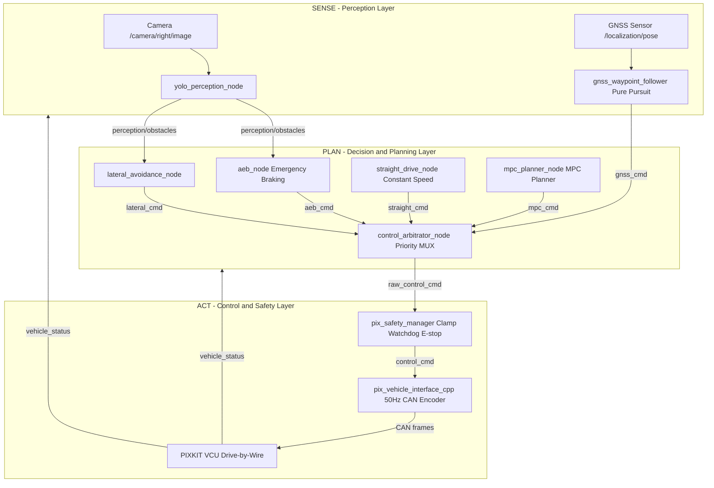

# PIX Autonomy Architecture Guide

> **Sense → Plan → Act** — the industry-standard layered architecture powering `pix_autonomy` in PIX Control Framework v16.

---

## Table of Contents

1. [Core Principle](#1-core-principle)
2. [Full Architecture Diagram](#2-full-architecture-diagram)
3. [Node Descriptions](#3-node-descriptions)
4. [Topic Map](#4-topic-map)
5. [Priority System](#5-priority-system)
6. [BaseAlgorithmInterface API](#6-basealgorithminterface-api)
7. [How to Add a New Algorithm](#7-how-to-add-a-new-algorithm)
8. [Building & Running](#8-building--running)

---

## 1. Core Principle

In a production autonomous vehicle system, **sensors never directly command actuators**. Instead, data flows through three distinct layers:

| Layer | Responsibility | Analogy |
|---|---|---|
| **Sense** | Perceive the environment — what is around the vehicle? | Eyes & Ears |
| **Plan** | Decide what to do — where and how fast should the vehicle go? | Brain |
| **Act** | Execute safely — filter, arbitrate, clamp, then send to hardware | Hands & Reflexes |

This separation means any perception algorithm can feed any planner, and any planner can be swapped without touching the hardware interface.

---

## 2. Full Architecture Diagram



---

## 3. Node Descriptions

### `yolo_perception_node.py` — The Eyes

| Property | Value |
|---|---|
| Package | `pix_autonomy` |
| Entry point | `yolo_perception_node` |
| Subscribes | `/camera/right/image` (`sensor_msgs/Image`) |
| Publishes | `/perception/obstacles` (`std_msgs/Float32MultiArray`) |
| Parameters | `model_path` (default: `yolov8n.pt`), `camera_topic` |
| Role | Runs YOLOv8 Nano on each frame, detects `person` class, estimates distance from bounding box height, publishes array of `[distance, lateral_offset]` pairs. Falls back to dummy mode if dependencies are missing. |

---

### `aeb_node.py` — The Reflexes

| Property | Value |
|---|---|
| Package | `pix_autonomy` |
| Entry point | `aeb_node` |
| Inherits | `BaseAlgorithmInterface` |
| Subscribes | `/perception/obstacles`, `/pix/vehicle_status` |
| Publishes | `/pix_autonomy/aeb_cmd` (`pix_vehicle_msgs/PixControlCmd`) |
| Parameters | `ttc_threshold` (default: `2.0` s) |
| Role | Reads minimum obstacle distance. Divides by current speed → Time-To-Collision. If TTC < threshold: publish full brake (`brake_target=100`, `emergency_stop=True`). Runs at 20 Hz. |

**AEB Trigger Logic:**
```
TTC = min_obstacle_distance / current_speed
if TTC < ttc_threshold:
    → BRAKE FULL, emergency_stop = True
```

---

### `straight_drive_node.py` — Constant Speed Driver

| Property | Value |
|---|---|
| Package | `pix_autonomy` |
| Entry point | `straight_drive_node` |
| Inherits | `BaseAlgorithmInterface` |
| Publishes | `/pix_autonomy/straight_cmd` (`pix_vehicle_msgs/PixControlCmd`) |
| Parameters | `speed` (default: `1.5` m/s) |
| Role | Outputs a constant forward drive command at the configured speed. Steering angle is 0. Used for straight-line AEB tests. |

---

### `gnss_waypoint_follower.py` — Navigation Planner

| Property | Value |
|---|---|
| Package | `pix_autonomy` |
| Entry point | `gnss_waypoint_follower` |
| Inherits | `BaseAlgorithmInterface` |
| Subscribes | `/localization/pose` (`geometry_msgs/PoseStamped`) |
| Publishes | `/pix_autonomy/gnss_cmd` (`pix_vehicle_msgs/PixControlCmd`) |
| Config | Reads `waypoints.txt` (X, Y coordinates, one per line) |
| Role | Implements **Pure Pursuit** lateral control. Computes the look-ahead steering angle to the next waypoint. Advances to the next waypoint when within arrival radius. |

---

### `lateral_avoidance_node.py` — Obstacle Avoider

| Property | Value |
|---|---|
| Package | `pix_autonomy` |
| Entry point | `lateral_avoidance_node` |
| Inherits | `BaseAlgorithmInterface` |
| Subscribes | `/perception/obstacles` (`std_msgs/Float32MultiArray`) |
| Publishes | `/pix_autonomy/lateral_cmd` (`pix_vehicle_msgs/PixControlCmd`) |
| Role | When an obstacle is detected within a safety radius, applies a lateral steering correction to steer around it while maintaining speed. Works in conjunction with YOLO perception. |

---

### `mpc_planner_node.py` — Advanced Planner

| Property | Value |
|---|---|
| Package | `pix_autonomy` |
| Entry point | `mpc_planner_node` |
| Inherits | `BaseAlgorithmInterface` |
| Subscribes | `/localization/pose` |
| Publishes | `/pix_autonomy/mpc_cmd` (`pix_vehicle_msgs/PixControlCmd`) |
| Role | **Boilerplate** for Model Predictive Control. Predicts future vehicle states over a horizon window, solves for the control sequence that minimises tracking error while respecting constraints. Replace `solve_mpc()` with your solver. |

---

### `control_arbitrator_node.py` — The Traffic Cop

| Property | Value |
|---|---|
| Package | `pix_autonomy` |
| Entry point | `control_arbitrator_node` |
| Subscribes | `/pix_autonomy/aeb_cmd`, `/pix_autonomy/joy_cmd`, `/pix_autonomy/mpc_cmd`, `/pix_autonomy/gnss_cmd`, `/pix_autonomy/lateral_cmd`, `/pix_autonomy/straight_cmd` |
| Publishes | `/pix/raw_control_cmd` (`pix_vehicle_msgs/PixControlCmd`) |
| Loop rate | 50 Hz |
| Role | Priority-based command multiplexer. Selects the highest-priority active command and forwards it to the Safety Manager. Commands older than a configurable timeout are discarded. |

---

## 4. Topic Map

### Perception Topics

| Publisher | Topic | Message Type | Subscriber(s) |
|---|---|---|---|
| Camera driver | `/camera/right/image` | `sensor_msgs/Image` | `yolo_perception_node` |
| GNSS driver | `/localization/pose` | `geometry_msgs/PoseStamped` | `gnss_waypoint_follower`, `mpc_planner_node` |
| `yolo_perception_node` | `/perception/obstacles` | `std_msgs/Float32MultiArray` | `aeb_node`, `lateral_avoidance_node` |

### Planner → Arbitrator Topics

| Publisher | Topic | Message Type |
|---|---|---|
| `aeb_node` | `/pix_autonomy/aeb_cmd` | `pix_vehicle_msgs/PixControlCmd` |
| External joystick | `/pix_autonomy/joy_cmd` | `pix_vehicle_msgs/PixControlCmd` |
| `mpc_planner_node` | `/pix_autonomy/mpc_cmd` | `pix_vehicle_msgs/PixControlCmd` |
| `gnss_waypoint_follower` | `/pix_autonomy/gnss_cmd` | `pix_vehicle_msgs/PixControlCmd` |
| `lateral_avoidance_node` | `/pix_autonomy/lateral_cmd` | `pix_vehicle_msgs/PixControlCmd` |
| `straight_drive_node` | `/pix_autonomy/straight_cmd` | `pix_vehicle_msgs/PixControlCmd` |

### Core Pipeline Topics

| Publisher | Topic | Message Type | Subscriber |
|---|---|---|---|
| `control_arbitrator_node` | `/pix/raw_control_cmd` | `pix_vehicle_msgs/PixControlCmd` | `pix_safety_manager` |
| `pix_safety_manager` | `/pix/control_cmd` | `pix_vehicle_msgs/PixControlCmd` | `pix_vehicle_interface_cpp` |
| `pix_vehicle_interface_cpp` | `/pix/vehicle_status` | `pix_vehicle_msgs/PixVehicleStatus` | All algorithm nodes |
| `pix_state_manager` | `/pix/system_state` | `pix_vehicle_msgs/PixSystemState` | `pix_safety_manager`, `pix_diagnostics` |

---

## 5. Priority System

The `control_arbitrator_node` enforces strict priority. Lower number = higher priority:

| Priority | Source | Topic | Use Case |
|:---:|---|---|---|
| **1 (Highest)** | AEB | `/pix_autonomy/aeb_cmd` | Collision imminent — unconditional brake |
| **2** | Joystick | `/pix_autonomy/joy_cmd` | Human override / teleoperation |
| **3** | MPC Planner | `/pix_autonomy/mpc_cmd` | Smooth autonomous navigation |
| **4** | GNSS Waypoint | `/pix_autonomy/gnss_cmd` | Waypoint-following navigation |
| **5** | Lateral Avoidance | `/pix_autonomy/lateral_cmd` | Obstacle steering correction |
| **6 (Lowest)** | Straight Drive | `/pix_autonomy/straight_cmd` | Default constant-speed forward |

> **Rule:** When AEB fires, the vehicle stops — regardless of what any other planner says. Once the obstacle clears and AEB stops publishing, the arbitrator falls back to the next active source.

---

## 6. BaseAlgorithmInterface API

All algorithm nodes inherit from `BaseAlgorithmInterface` in `pix_algorithm_api`:

```python
from pix_algorithm_api.base_algorithm_interface import BaseAlgorithmInterface

class MyNode(BaseAlgorithmInterface):
    def __init__(self):
        # node_name   : ROS 2 node name
        # topic       : topic this node publishes commands to
        super().__init__('my_node', '/pix_autonomy/my_cmd')
```

### Available Methods

| Method | Description |
|---|---|
| `get_vehicle_status()` | Returns latest `PixVehicleStatus` (thread-safe) |
| `publish_control_cmd(**kwargs)` | Publishes a `PixControlCmd` to the algorithm's topic |

### `publish_control_cmd` Parameters

| Parameter | Type | Default | Description |
|---|---|---|---|
| `drive_en` | `bool` | `False` | Enable drive |
| `speed_target` | `float` | `0.0` | Target speed (m/s) |
| `accel_target` | `float` | `0.0` | Target acceleration (m/s²) |
| `steer_en` | `bool` | `False` | Enable steering |
| `steer_target` | `float` | `0.0` | Target steering angle (degrees) |
| `steer_speed` | `float` | `150.0` | Steering rate (degrees/s) |
| `brake_en` | `bool` | `False` | Enable brake |
| `brake_target` | `float` | `0.0` | Brake pressure (0–100%) |
| `gear_en` | `bool` | `False` | Enable gear command |
| `gear_target` | `int` | `0` | Gear (0=N, 3=D, 4=R) |
| `emergency_stop` | `bool` | `False` | Unconditional E-stop flag |

---

## 7. How to Add a New Algorithm

The following example adds a **Lane Keep Assist (LKA)** algorithm in 5 steps.

### Step 1 — Create the Node File

Create `src/pix_autonomy/pix_autonomy/lka_node.py`:

```python
#!/usr/bin/env python3
from pix_algorithm_api.base_algorithm_interface import BaseAlgorithmInterface
from std_msgs.msg import Float32

class LKANode(BaseAlgorithmInterface):
    def __init__(self):
        # Name your node and declare the topic it outputs commands to
        super().__init__('lka_node', '/pix_autonomy/lka_cmd')

        # Subscribe to your lane detection output
        self.lane_sub = self.create_subscription(
            Float32,
            '/perception/lane_error',   # lateral error in metres
            self.lane_callback,
            10
        )
        self.lateral_error = 0.0
        self.create_timer(0.02, self.control_loop)  # 50 Hz

    def lane_callback(self, msg):
        self.lateral_error = msg.data

    def control_loop(self):
        # Simple proportional controller
        steer_correction = -self.lateral_error * 30.0  # 30 deg/m gain
        steer_correction = max(-100.0, min(100.0, steer_correction))

        self.publish_control_cmd(
            drive_en=True,
            speed_target=3.0,
            steer_en=True,
            steer_target=steer_correction,
            steer_speed=150.0,
            gear_en=True,
            gear_target=3   # Drive
        )

def main(args=None):
    import rclpy
    rclpy.init(args=args)
    node = LKANode()
    rclpy.spin(node)
    node.destroy_node()
    rclpy.shutdown()
```

### Step 2 — Register the Entry Point

Open `src/pix_autonomy/setup.py` and add to `console_scripts`:

```python
'console_scripts': [
    # ... existing entries ...
    'lka_node = pix_autonomy.lka_node:main',
],
```

### Step 3 — Add to the Arbitrator

Open `src/pix_autonomy/pix_autonomy/control_arbitrator_node.py`:

```python
# 1. Add subscription
self.lka_sub = self.create_subscription(
    PixControlCmd, '/pix_autonomy/lka_cmd', self.lka_cb, 10
)

# 2. Add to latest_cmds dict
self.latest_cmds = {
    ...,
    'lka': (None, 0.0),
}

# 3. Add callback
def lka_cb(self, msg): self._update_cmd('lka', msg)

# 4. Insert priority slot in arbitrate_loop()
# Between 'gnss' and 'lateral' — LKA overrides GNSS but yields to AEB/Joy/MPC
```

### Step 4 — Build

```bash
colcon build --packages-select pix_autonomy --symlink-install
source install/setup.bash
```

### Step 5 — Run

```bash
# In a separate terminal alongside the core framework:
ros2 run pix_autonomy lka_node
```

> 💡 **Tip:** Use `--ros-args -p param_name:=value` to override parameters at runtime without editing YAML files.

---

## 8. Building & Running

### Build pix_autonomy only

```bash
colcon build --packages-select pix_autonomy pix_algorithm_api --symlink-install
source install/setup.bash
```

### Run the full autonomy test (AEB + YOLO + Straight Drive)

```bash
# Terminal 1 — Core hardware framework
ros2 launch launch/hw_framework.launch.py

# Terminal 2 — Full autonomy test
ros2 launch src/pix_autonomy/launch/autonomy_test.launch.py
```

### Run nodes individually

```bash
ros2 run pix_autonomy control_arbitrator_node
ros2 run pix_autonomy yolo_perception_node
ros2 run pix_autonomy aeb_node
ros2 run pix_autonomy straight_drive_node
ros2 run pix_autonomy gnss_waypoint_follower
ros2 run pix_autonomy lateral_avoidance_node
ros2 run pix_autonomy mpc_planner_node
```

### Tune parameters at runtime

```bash
# Change straight-drive speed
ros2 run pix_autonomy straight_drive_node --ros-args -p speed:=2.5

# Change AEB threshold (brake at 3 s TTC instead of 2 s)
ros2 run pix_autonomy aeb_node --ros-args -p ttc_threshold:=3.0

# Change YOLO model
ros2 run pix_autonomy yolo_perception_node --ros-args -p model_path:=/path/to/yolov8s.pt
```

### Inspect live topics

```bash
# Monitor arbitrator output
ros2 topic echo /pix/raw_control_cmd

# Monitor obstacle detections
ros2 topic echo /perception/obstacles

# Check vehicle status
ros2 topic echo /pix/vehicle_status

# View all active topics
ros2 topic list
```
