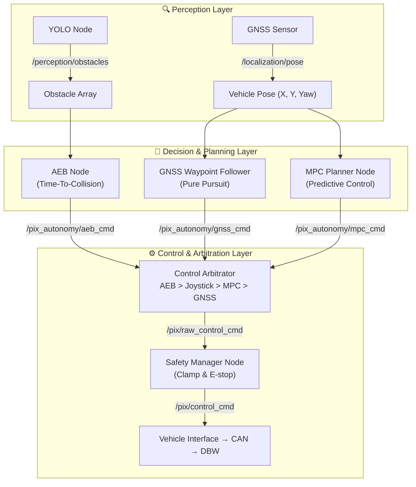

# PIX Autonomy Architecture Guide

> This document details the **Sense → Plan → Act** architecture implemented in the PCF `pix_autonomy` package — an industry-standard pattern used in production autonomous vehicle systems.

---

## 1. The Autonomous Flow — Sense → Plan → Act

In a production autonomous system, sensors never command actuators directly. Data flows through dedicated processing layers:



### Layer Responsibilities

| Layer | Role | Key Principle |
|---|---|---|
| **Perception** | Identifies *what* and *where* things are | Never sends motor commands |
| **Planning** | Computes desired trajectory from sensor data | Never talks directly to hardware |
| **Control/Arbitration** | Selects winning command, enforces limits | Single gatekeeper to hardware |

---

## 2. `pix_autonomy` Nodes — Detailed Reference

### `yolo_perception_node.py` — The Eyes

- **Input:** Camera image stream
- **Process:** Runs YOLOv8 inference to detect people and objects
- **Output:** `sensor_msgs/Float32MultiArray` on `/perception/obstacles` (distances to detected objects)
- **Model:** `yolov8n.pt` (bundled in repo root)

### `gnss_waypoint_follower.py` — The Basic Brain

- **Input:** `/localization/pose` (vehicle X, Y, Yaw)
- **Process:** Reads `waypoints.txt`, computes **Pure Pursuit** steering angle to the next waypoint
- **Output:** `pix_control_msgs/Control` on `/pix_autonomy/gnss_cmd`

### `mpc_planner_node.py` — The Advanced Brain

- **Input:** `/localization/pose` + `/perception/obstacles`
- **Process:** Model Predictive Control — solves for optimal path while predicting future vehicle states and avoiding obstacles
- **Output:** `pix_control_msgs/Control` on `/pix_autonomy/mpc_cmd`

### `aeb_node.py` — The Reflexes

- **Input:** `/perception/obstacles` (obstacle distances) + `/pix/velocity_report` (current speed)
- **Process:** Computes **Time-To-Collision (TTC)**. If TTC < 2.0 seconds → fires emergency brake override
- **Output:** `pix_control_msgs/Control` on `/pix_autonomy/aeb_cmd`
- **Log output:** `[ERROR] AEB ENGAGED! TTC: x.xxs, Dist: y.yym`

### `straight_drive_node.py` — The Tester

- **Process:** Publishes a constant forward speed command (configurable in `autonomy_params.yaml`)
- **Output:** `pix_control_msgs/Control` on `/pix_autonomy/gnss_cmd`
- **Use case:** Straight-line AEB testing

### `control_arbitrator_node.py` — The Traffic Cop

- **Input:** All autonomy command topics
- **Priority (highest → lowest):** `AEB > Joystick > MPC > GNSS/Straight`
- **Output:** Single winning command on `/pix/raw_control_cmd` → Safety Manager

---

## 3. Topic Map

```
/perception/obstacles          ← yolo_perception_node
/localization/pose             ← GNSS driver (external)

/pix_autonomy/aeb_cmd          ← aeb_node
/pix_autonomy/mpc_cmd          ← mpc_planner_node
/pix_autonomy/gnss_cmd         ← gnss_waypoint_follower / straight_drive_node

/pix/raw_control_cmd           ← control_arbitrator_node
/pix/control_cmd               ← safety_manager_node (final gated output)
/pix/velocity_report           → aeb_node, safety_manager_node
```

---

## 4. Adding a New Algorithm

### Step 1 — Create the node, inherit the base class

```python
# src/pix_autonomy/pix_autonomy/lka_node.py
from pix_algorithm_api.base_algorithm_interface import BaseAlgorithmInterface

class LKANode(BaseAlgorithmInterface):
    def __init__(self):
        super().__init__('lka_node', '/pix_autonomy/lka_cmd')
```

### Step 2 — Implement your logic

```python
def compute(self):
    calculated_steer = self._run_lane_detection()   # your logic
    self.publish_control_cmd(
        drive_en=True,   speed_target=5.0,
        steer_en=True,   steer_target=calculated_steer,
        steer_speed=150.0,
        gear_en=True,    gear_target=3
    )
```

### Step 3 — Register in `control_arbitrator_node.py`

```python
# Add subscriber
self.create_subscription(Control, '/pix_autonomy/lka_cmd', self._lka_cb, 10)

# Add priority slot in arbitrate_loop()
# Priority order: AEB > Joystick > LKA > MPC > GNSS
if self._lka_cmd:
    return self._lka_cmd
```

### Step 4 — Register in `setup.py`

```python
'console_scripts': [
    'lka_node = pix_autonomy.lka_node:main',
    # ... existing entries
],
```

### Step 5 — Build & run

```bash
colcon build --packages-select pix_autonomy
source install/setup.bash
ros2 run pix_autonomy lka_node
```

---

## 5. Configuration Reference

All autonomy parameters live in `src/pix_autonomy/config/autonomy_params.yaml`. No rebuild needed — edit and relaunch.

```yaml
straight_drive_planner:
  speed: 1.5              # m/s — test drive speed

aeb_node:
  ttc_threshold: 2.0      # seconds — lower = brake later, higher = brake earlier
  min_obstacle_dist: 0.5  # m — ignore obstacles closer than this (noise filter)

mpc_planner:
  horizon: 10             # prediction steps
  dt: 0.1                 # seconds per step

gnss_waypoint_follower:
  lookahead_distance: 2.0 # Pure Pursuit lookahead (m)
  waypoint_file: waypoints.txt
```

---

## 6. Running the Autonomy Stack

```bash
# Option A: Full launch (recommended)
ros2 launch pix_autonomy autonomy_test.launch.py

# Option B: Individual nodes
ros2 run pix_autonomy control_arbitrator_node
ros2 run pix_autonomy gnss_waypoint_follower
ros2 run pix_autonomy aeb_node
ros2 run pix_autonomy yolo_perception_node
```

> ⚠️ **Safety:** As soon as the autonomy stack launches on a real vehicle, it will begin moving. Always have a hardware E-stop within reach.

---

*Part of [PIX Control Framework v15.0](README.md)*
