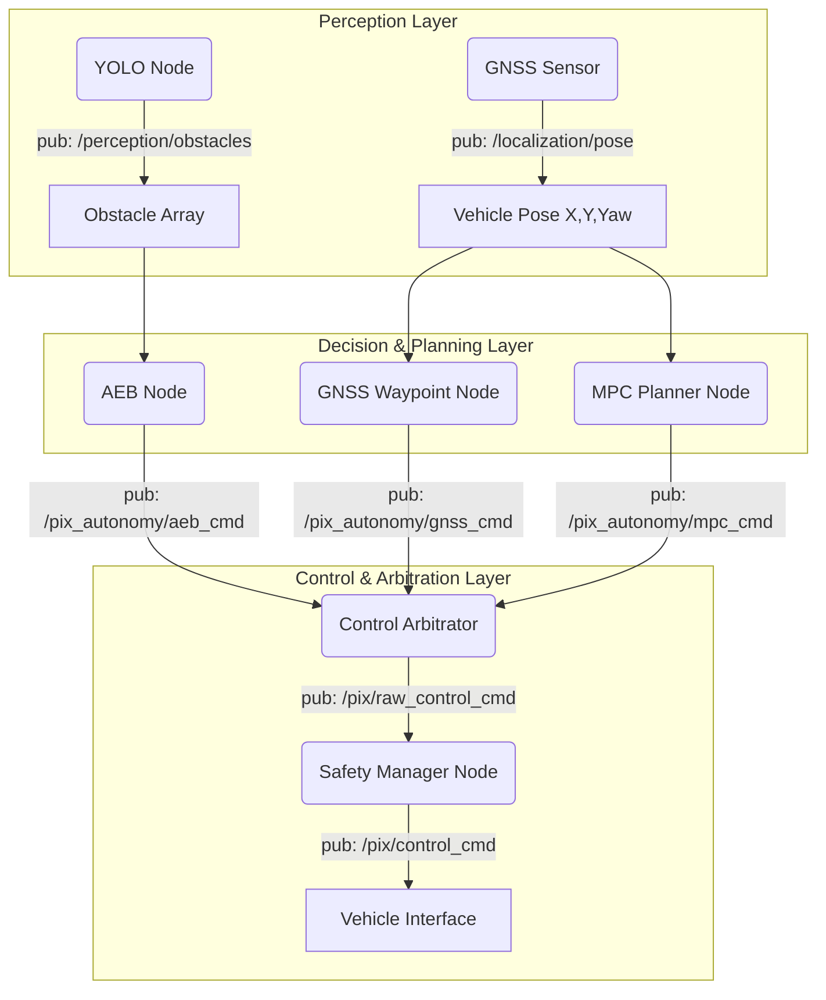

# PIX Autonomy Architecture Guide

This guide explains the industry-standard **Sense $\rightarrow$ Plan $\rightarrow$ Act** architecture implemented in your new `pix_autonomy` ROS2 package, demonstrating how to seamlessly integrate new algorithms like GNSS Waypoint Following, MPC Planning, YOLO Perception, and AEB (Autonomous Emergency Braking) into the PIX Control Framework.

---

## 1. The Autonomous Flow (Sense $\rightarrow$ Plan $\rightarrow$ Act)

In an industry-level system, you **never** want sensors (cameras, LiDAR) directly sending steering commands to the wheels. Instead, the data flows through specialized layers:



### The Roles:
1. **Perception (YOLO):** Identifies *what* and *where* things are. Outputs bounding boxes and distances.
2. **Planners (GNSS / MPC):** Looks at the target (waypoints) and constraints (obstacles). Outputs a desired trajectory (Speed, Steering Angle).
3. **Control Arbitrator:** A multiplexer. If multiple planners are running (e.g., AEB and GNSS), it picks the highest priority one.
4. **Safety Manager:** The final gatekeeper. Ensures the Arbitrator's chosen command doesn't exceed hardware limits (max steering rate, E-stops).

---

## 2. Package Overview (`pix_autonomy`)

I have created a dedicated ROS2 package for your high-level autonomy logic at `src/pix_autonomy`. It contains the following nodes:

### `yolo_perception_node.py` (The Eyes)
* **What it does:** Subscribes to your camera feed, runs YOLO, and publishes an array of distances to detected objects on `/perception/obstacles`.

### `gnss_waypoint_follower.py` (The Basic Brain)
* **What it does:** Reads a list of X,Y coordinates from a `waypoints.txt` file. It calculates the Pure Pursuit steering angle required to reach the next waypoint.
* **Output:** Publishes driving commands to `/pix_autonomy/gnss_cmd`.

### `mpc_planner_node.py` (The Advanced Brain)
* **What it does:** A boilerplate for a Model Predictive Controller. Instead of just aiming for a point, MPC predicts future vehicle states and solves for the smoothest path avoiding obstacles.
* **Output:** Publishes driving commands to `/pix_autonomy/mpc_cmd`.

### `aeb_node.py` (The Reflexes)
* **What it does:** Subscribes to the vehicle's current speed and the YOLO obstacles. It calculates **TTC (Time To Collision)**. If TTC drops below 2 seconds, it instantly fires a maximum braking command.
* **Output:** Publishes an override command to `/pix_autonomy/aeb_cmd`.

### `control_arbitrator_node.py` (The Traffic Cop)
* **What it does:** Listens to all the commands above. 
* **Logic:** Priority is strictly enforced. `AEB > Joystick > MPC > GNSS`. If AEB fires, the vehicle stops, ignoring whatever the GNSS planner is saying. It outputs the winning command to `/pix/raw_control_cmd` for the Safety Manager.

---

## 3. How to add a NEW feature (Step-by-Step)

If you want to add something entirely new—for example, a **Lane Keep Assist (LKA)** feature:

### Step 1: Create the Node
Create `lka_node.py`. Inherit from `BaseAlgorithmInterface` so you easily get vehicle speed and steering feedback.

```python
from pix_algorithm_api.base_algorithm_interface import BaseAlgorithmInterface

class LKANode(BaseAlgorithmInterface):
    def __init__(self):
        # Name the node, and define the topic it outputs to
        super().__init__('lka_node', '/pix_autonomy/lka_cmd')
```

### Step 2: Write the Logic
Subscribe to your camera's lane detection output. Calculate how much steering is needed to stay in the center.

### Step 3: Publish the Command
Use the built-in helper from the base class to push the command:
```python
self.publish_control_cmd(
    drive_en=True, speed_target=5.0,  # Maintain 5 m/s
    steer_en=True, steer_target=calculated_steer, steer_speed=150.0,
    gear_en=True, gear_target=3       # Drive
)
```

### Step 4: Add it to the Arbitrator
Open `control_arbitrator_node.py`. 
1. Add a subscriber for `/pix_autonomy/lka_cmd`.
2. Give it a priority slot in the `arbitrate_loop()` (e.g., above GNSS, below AEB).

### Step 5: Update `setup.py`
Add your new script to the `entry_points` in `setup.py` so ROS2 knows it exists:
```python
'console_scripts': [
    'lka_node = pix_autonomy.lka_node:main',
]
```

---

## 4. Building and Running

To use this new package, navigate to the root of your workspace (e.g., `~/ros2_ws` or `Custom_Interface_study/pix_control_framework`) and compile:

```bash
colcon build --packages-select pix_autonomy
source install/setup.bash
```

**Running the nodes:**
You can run them individually in separate terminals:
```bash
ros2 run pix_autonomy control_arbitrator_node
ros2 run pix_autonomy gnss_waypoint_follower
ros2 run pix_autonomy aeb_node
ros2 run pix_autonomy yolo_perception_node
```

With this architecture, your PIX framework is now structured exactly like a production autonomous vehicle system!
